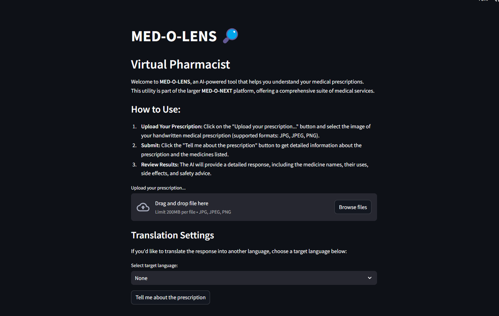

# MED-O-LENS

## Overview
MED-O-LENS is an AI-powered utility designed to analyze handwritten medical prescriptions. It is a part of the broader MED-O-NEXT platform, which integrates technology into healthcare services to create a seamless experience. MED-O-LENS helps users understand their medications by extracting essential details like medicine names, uses, side effects, and safety advice, all powered by AI.

## Problem Statement
The challenge of deciphering handwritten medical prescriptions often leads to confusion and errors in medication usage. This issue affects patient safety, medication adherence, and healthcare outcomes.

## Our Approach
We utilize advanced AI and machine learning techniques to decode handwritten prescriptions, enabling accurate extraction of medication details. This approach ensures that users are provided with clear, understandable information about their prescribed drugs.

## Features
- AI-powered prescription analysis
- Automatic extraction of medication details
- Identification of potential side effects and safety advice
- User-friendly interface for easy access to information

## Special Attributes
- Integration with the MED-O-NEXT platform
- Real-time processing of prescriptions
- Compatibility with various prescription formats

## Uniqueness of Idea
MED-O-LENS stands out by offering a fully automated solution for interpreting handwritten prescriptions, a common yet underserved challenge in healthcare. The seamless integration with MED-O-NEXT enhances its utility within a larger ecosystem focused on improving patient care through technology.

## Screenshots
### Screenshot 1

### Screenshot 2

## How to Contribute
We welcome contributions from developers interested in improving MED-O-LENS! Here are a few ways to contribute:
1. Fork the repository
2. Create a new branch (`git checkout -b feature-branch`)
3. Make your changes and commit them (`git commit -m 'Add some feature'`)
4. Push to the branch (`git push origin feature-branch`)
5. Open a Pull Request

Please make sure your code adheres to the style guidelines and includes tests where applicable.

## License
This project is licensed under the MIT License - see the LICENSE file for details.
